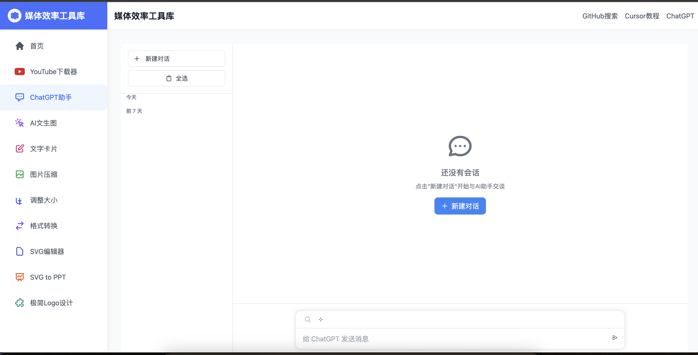

# 媒体效率工具库

一个基于 FastAPI + Tailwind CSS 的综合性媒体图像在线工具平台，集成了媒体处理、AI助手、实用工具等多种功能模块。

## 平台概述

### 核心特点
- 模块化设计，易于扩展
- 统一的用户界面和操作体验
- 响应式布局，支持多端访问
- RESTful API支持
- 实时处理反馈
- 批量处理能力
- 支持扩展工具
- 绝大部分工具通过浏览器本地完成


### 功能分类

#### 1. 媒体处理工具
- **YouTube下载器**
  - 单视频/批量下载
  - 音视频分离
  - 格式转换
  - 在线预览
- **图片处理**
  - 图片压缩
  - 格式转换
  - 支持JPG、PNG、WEBP、GIF格式
  - 本地处理无需上传
  - 批量转换功能
  - 单文件最大15MB
  - 批量处理
  - 在线预览
- **音视频工具**（开发中）
  - 视频压缩
  - 格式转换
  - 视频剪辑
  - 音频提取

#### 2. AI助手工具
- **ChatGPT对话**
  - 多轮对话支持
  - 上下文记忆
  - 代码高亮
  - 会话导出
- **AI图像生成**（开发中）
  - 文本生图
  - 图片编辑
  - 风格迁移
- **智能助手**（规划中）
  - 文本摘要
  - 代码解释
  - 数据分析

#### 3. 实用工具集
- **文档处理**
  - PDF转换
  - 文字提取
  - 格式转换
- **开发工具**
  - 代码格式化
  - JSON编辑器
  - 正则测试
- **其他工具**
  - 文字卡片生成
  - 二维码生成
  - 图表制作

## 技术架构

### 后端架构
- **Web框架**: FastAPI
- **数据库**: 
  - SQLite (本地存储)
  - Redis (缓存)
- **媒体处理**:
  - FFmpeg (音视频)
  - Pillow (图片)
  - yt-dlp (视频下载)
- **AI集成**:
  - OpenAI API
  - Stable Diffusion
- **任务队列**: Celery

### 前端技术
- **UI框架**: 
  - TailwindCSS
  - Alpine.js
- **交互组件**:
  - Video.js
  - CodeMirror
  - Chart.js
- **构建工具**: 
  - Webpack
  - PostCSS

### 部署架构
- **应用服务器**: uvicorn
- **反向代理**: Nginx
- **容器化**: Docker
- **CI/CD**: GitHub Actions

## 项目结构
```
media-tools/
├── config/                # 配置文件
│   ├── settings.py       # 全局设置
│   └── tools.py          # 工具配置
├── core/                 # 核心模块
│   ├── database.py      # 数据库配置
│   ├── security.py      # 安全相关
│   └── celery_app.py    # Celery配置
├── modules/             # 功能模块
│   ├── youtube/        # YouTube下载
│   ├── image_compress/ # 图片压缩
│   ├── chatgpt/       # AI对话
│   ├── text_card/     # 文字卡片
│   └── utils/         # 通用工具
├── static/             # 静态资源
├── templates/          # 模板文件
│   ├── common/        # 通用模板 
│   │   ├── developing/     # 开发中模板
│   │   ├── 404.html       # 404模板
│   ├── home/          # 首页模板
│   ├── navigation/    # 导航模板
│   ├── tools/         # 工具模板
│       ├── youtube/        # YouTube下载
│       ├── image_compress/ # 图片压缩
│       ├── chatgpt/        # AI对话
│       ├── text_card/      # 文字卡片
│       ├── image_format/   # 图片格式转换
│       ├── svg_editor/     # SVG编辑器
│       ├── qr_code/        # 二维码生成器
│       └── resize/         # 调整大小
├── readme_static/      # readme文档静态资源
├── toolsfile/         # 文件存储
├── tests/             # 测试用例
└── docs/              # 文档
```

## 工具功能模块详解

### 1. YouTube下载器
- 支持单个视频下载和批量下载
- 自动提取音频和缩略图
- 支持下载YouTube Shorts短视频
- 按日期和用户分类管理下载内容
- 实时显示下载进度
- 支持视频预览和在线播放
- 显示详细的视频信息（标题、作者、时长等）


### 2. ChatGPT对话
- **功能特点**
  - 支持多种对话模式
  - 代码高亮显示
  - 会话历史管理
  - Markdown渲染
- **使用方法**
  - 选择对话模式
  - 输入问题
  - 查看历史记录
  - 导出会话

### 3.AI文生图
- 待开发中

### 4.文字卡片生成
- 支持markdown格式
- 支持多种卡片模板
- 支持卡片自定义样式
- 支持卡片导出为图片
- 支持导出图片png,jpg格式


### 5. 图片压缩工具
- 支持多种图片格式(PNG、JPG、JPEG、WebP)
- 智能压缩算法，在保证画质的同时大幅减小文件体积
- 批量处理功能
- 自定义压缩参数：
  - 压缩质量(0-100)
  - 最大宽度限制(可选)
  - EXIF信息保留选项
- 直观的压缩效果预览
- 便捷的图片下载方式

### 6. 调整大小工具
- 完全本地处理，无需上传服务器
- 支持拖放上传图片
- 实时预览调整效果
- 智能锁定宽高比例
- 支持PNG、JPG、GIF等常见格式
- 最大支持10000x10000像素
- 高质量图片处理
- 一键下载调整后的图片

### 7.格式转换工具
- 支持多种图片格式(PNG、JPG、JPEG、WebP)
- 支持预览转换结果
- 支持批量转换
- 支持单个下载和批量下载
- 支持JPG、PNG、WEBP、GIF格式互转
- 支持输出质量调节

### 8.SVG编辑器
- 支持SVG格式编辑
- 支持SVG格式导出
- 支持SVG格式导入
- 支持SVG格式预览
- 支持SVG格式下载

### 9.二维码生成器

#### 功能介绍

二维码生成器支持单个和批量生成网址二维码，具有以下特点：

1. 单个链接生成
   - 支持输入单个网址生成二维码
   - 可添加自定义Logo(支持PNG、JPG、SVG格式，尺寸≤300x300)
   - 可添加二维码说明文字(最多20字)
   - 实时预览效果
   - 一键下载PNG格式二维码

2. 批量链接生成
   - 支持一次性输入最多20个网址
   - 支持统一添加Logo
   - 支持统一添加二维码说明文字
   - 网格布局预览所有二维码
   - 支持单个下载和批量打包下载


#### 技术说明

- 使用QRCode.js生成二维码
- 使用JSZip处理批量下载
- 支持SVG格式Logo处理
- 自动进行文字换行和截断处理
- 针对高分辨率显示优化

#### 更新记录

- 2024-03-xx：
  1. 初始版本发布
  2. 支持单个和批量生成
  3. 支持自定义Logo和说明文字
  4. 支持批量打包下载

### 图片处理
- **图片压缩**
  - 支持多种格式图片压缩
  - 可调节压缩质量
  - 实时预览效果
- **格式转换**
  - 支持JPG、PNG、WEBP、GIF格式互转
  - 本地浏览器处理,无需上传
  - 批量转换功能
  - 单文件最大15MB
  - 可调节输出质量
  - 实时预览效果
  - 支持拖拽上传
  - 支持单个/批量下载
- **调整大小**
  - 自由调整图片尺寸
  - 保持宽高比例
  - 实时预览效果

## 开发规范

### 代码规范
- Python: PEP 8
- JavaScript: ESLint
- HTML/CSS: Prettier
- 提交信息: Angular规范

### 文档规范
- 代码注释完整
- API文档及时更新
- 更新日志维护
- 测试用例覆盖

## 部署指南

1. 克隆项目
```bash
git clone https://github.com/yourusername/media-tools.git
cd media-tools
```

2. 安装依赖
```bash
pip install -r requirements.txt
```

3. 安装FFmpeg
- Windows: 下载并添加到系统环境变量
- macOS: `brew install ffmpeg`
- Linux: `sudo apt-get install ffmpeg`

4. 创建必要的目录
```bash
mkdir -p toolsfile/youtube/{videos,batch_videos}
mkdir -p dbfile/youtube
mkdir -p static/images
```

5. 启动服务
```bash
uvicorn main:app --reload
```

6. 访问服务
打开浏览器访问 http://localhost:8000

## 使用指南

### 首页


### 1.YouTube下载器
1. 单视频下载
   - 输入视频URL
   - 选择下载质量
   - 点击下载按钮
2. 批量下载
   - 输入频道URL
   - 设置下载参数
   - 开始批量下载
3. 下载管理
   - 查看下载历史
   - 管理已下载文件
   - 预览和播放视频 
 


### 2.ChatGPT对话
1. 选择对话模式
2. 输入问题
3. 查看历史记录
4. 导出会话


### 3.AI文生图
1.待开发中


### 4.文字卡片生成
1. 支持markdown格式
2. 支持多种卡片模板
3. 支持卡片自定义样式
4. 支持卡片导出为图片
5. 支持导出图片png,jpg格式


### 5.图片压缩工具
1. 上传图片
   - 点击上传或拖拽图片
   - 支持批量上传
2. 设置压缩参数
   - 调整压缩质量
   - 设置最大宽度
   - 选择EXIF选项
3. 下载结果
   - 点击图片下载
   - 批量下载全部


### 6.调整大小工具
1. 选择或拖放图片到上传区域
2. 在调整设置中输入目标宽度或高度
3. 可选择是否锁定宽高比例
4. 点击"调整大小"按钮预览效果
5. 确认效果后点击下载按钮保存


### 7.格式转换工具
1. 上传图片
   - 点击选择或拖拽上传图片
   - 支持批量上传
   - 支持JPG、PNG、WEBP、GIF格式
   - 单个文件限制15MB

2. 转换设置
   - 选择目标格式(JPG/PNG/WEBP/GIF)
   - 调整输出质量(1-100%)
   - 点击"开始转换"按钮

3. 转换过程
   - 显示实时转换进度
   - 可以预览转换前后的图片
   - 显示文件大小变化

4. 下载结果
   - 点击单个图片或下载按钮下载
   - 点击"下载全部"批量下载
   - 自动添加正确的文件扩展名

5. 注意事项
   - 所有处理在本地完成,不会上传服务器
   - 可以随时切换目标格式重新转换
   - 批量下载时会有短暂延迟
   - 建议大文件先压缩后转换


### 8.SVG编辑器
1. 上传SVG文件
   - 点击选择或拖拽上传SVG文件
   - 支持批量上传
2. 编辑功能
   - 支持SVG文件编辑
   - 支持SVG文件导出
   - 支持SVG文件导入
   - 支持SVG文件预览
   - 支持SVG文件下载


### 9.二维码生成器
1. 单个链接生成：
   - 输入以http://或https://开头的网址
   - 可选择上传Logo图片(≤300x300)
   - 可输入二维码说明文字(≤20字)
   - 点击"生成二维码"按钮
   - 预览效果后点击"下载二维码"

2. 批量链接生成：
   - 每行输入一个网址(最多20个)
   - 可选择上传统一Logo
   - 可输入统一的二维码说明文字
   - 点击"批量生成二维码"按钮
   - 可单独下载或点击"下载全部二维码"打包下载

#### 注意事项

1. 网址格式要求：
   - 必须以http://或https://开头
   - 确保网址可访问

2. Logo图片要求：
   - 支持PNG、JPG、SVG格式
   - 尺寸不超过300x300像素
   - 建议使用透明背景的图片

3. 说明文字限制：
   - 最多支持20个字符
   - 超出部分会自动截断
   - 支持中英文混合

4. 生成的二维码：
   - 尺寸固定为400x400像素
   - Logo大小自动调整为二维码的1/4
   - 说明文字位于二维码下方
   - 导出格式为PNG

   
   

## 开发计划

### 2024 Q1
- [ ] 完善AI助手功能
- [ ] 优化媒体处理性能
- [ ] 添加用户系统

### 2024 Q2
- [ ] 集成更多AI模型
- [ ] 添加数据分析功能
- [ ] 优化移动端体验

## 贡献指南

欢迎提交Issue和Pull Request。在提交PR之前，请确保：
1. 代码符合项目规范
2. 添加必要的测试
3. 更新相关文档

## 许可证

MIT License

## 联系方式

- 项目主页：[GitHub](https://github.com/yourusername/media-tools)
- 问题反馈：[Issues](https://github.com/yourusername/media-tools/issues) 